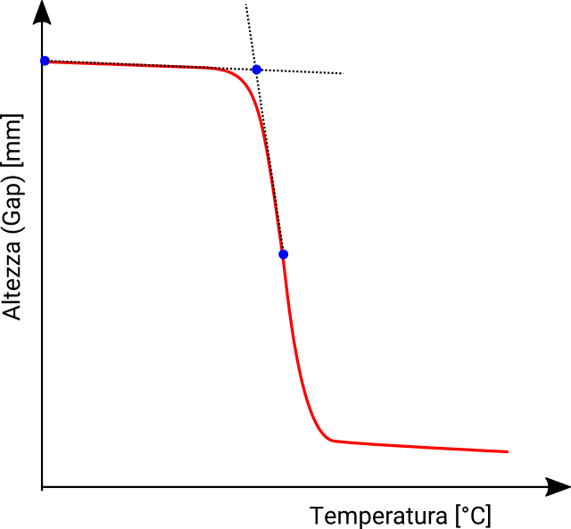

The `ctest()` function is used to calculate the melting point of chocolate using the collapse test method

## Function

Below the sintax of the function `ctest()`:

    ctest(analisi, xlim, ylim, main='Collapse test', point=F, values=T, dt=F, mm=1)
    
where:

    analisi :   analysis data frame (see below)
    xlim    :   x axix limits                                                             c(26, 35)
    ylim    :   y axis limits                                                               c(0, 5)
    main    :   graph title                                                         'Collapse test'
    point   :   boolean, T=print points on graph, F=print only line                               F
    values  :   boolean, T=print derivative values on graph, F=don't print values                 T
    dt      :   boolean, T=plot derivatives on graph                                              F
    mm      :   integer, moving average step (1=no moving average)                                1

## Analysis data frame

The analysis data file, must contain the following field:

    Test        :   test label (used in the legend)
    Temperature :   temperature values in °C
    Gap         :   thickness of the chocolate sample

as the following example:

```{r, echo=FALSE}
library(tecTools)
data('choc_ctest')
knitr::kable(head(choc_ctest))
```

## Softening point calculation

The onset softenening point is calcolated as  as the intersection of:

* the tangent to the curve at the starting point displayed
* The tangent to the curve point of the curve displayed  

```{r, fig.cap='Onset calculation', echo=FALSE, out.width="100%", fig.align='center'}

```

## Examples

In the following graph we could compare the melting point of three differnt chocolate:

```{r, echo=TRUE, fig.height=7.1, fig.width=7.1, fig.show='hold', warning=FALSE, results='hold'}
library(tecTools)
data('choc_ctest')
ctest(choc_ctest)
```

...the same graph with plotted the point of minimum and maximum of the derivative:

```{r, echo=TRUE, fig.height=7.1, fig.width=7.1, fig.show='hold', warning=FALSE, results='hold'}
library(tecTools)
data('choc_ctest')
ctest(choc_ctest, value=T)
```


...the same with first and second derivative plotted:

```{r, echo=TRUE, fig.height=7.1, fig.width=7.1, fig.show='hold', warning=FALSE, results='hold'}
library(tecTools)
data('choc_ctest')
ctest(choc_ctest, dt=T)
```

The `ctest()` function return a list with all the results:

```{r echo=TRUE, fig.height=7.1, fig.width=7.1, fig.show='hide', warning=FALSE, results='hold'}
library(tecTools)
data('choc_ctest')
a <- ctest(choc_ctest, dt=T)
str(a)
```

## Reference

The function  `ctest()` is based on the following article ^[available to the library author]:

> "Metodo collapse test"  Soremartec DTS Analiysis Method

> "Characterization of Heat Resistant Milk Chocolate" - Master Michele Ferrero 2010  
Carolina Dicolla, Swamy Anantheswaran, Doug Broun


