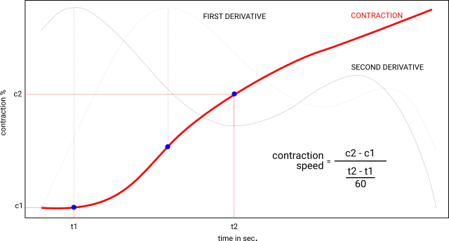

The `contraction()` function is used to graph the contraction measured with Aasted ChocoAnalyzer and calculate contraction speed in '% / min'

## Function

Below the sintax of the function `contraction()`:

    ctest(path="~/SFTP_Area/ITA18_Project_Area/PTPM_Praline",
          nome="",
          poly.gr=6,
          d1_peak=2,
          d2_peak=c(3,4)))
    
where:

    path    :   path to the file                      "~/SFTP_Area/ITA18_Project_Area/PTPM_Praline"
    nome    :   file name                                                                        ""
    poly.gr :   degree of the interpolator polynomial                                             6
    d1_peak :   number of peak of the first derivative to use                                     2
    d2_peak :   number of the two peaks of the second derivative to use                      c(3,4)


## Contraction speed calculation

The contraction speed is calcolated as ratio :

* the contraction from the higher acceleration and deceleration point
* the time in minutes from the two point 

```{r, fig.cap='Onset calculation', echo=FALSE, out.width="100%", fig.align='center'}

```

## Examples

In the following graph we could see the wrong selection of the second derivative peak with the default value of the `d2_peak` : d2_peak=c(3, 4)

```{r, echo=2, fig.height=7.1, fig.width=7.1, fig.show='hold', warning=FALSE, results='hold'}
library(tecTools)
contraction('../data', '2018.10.15 Contraction_Latte 2001_2018-10-11-14-38.csv')
```


...the same with the correct peaks selected : d2_peak=c(2, 3)

```{r, echo=TRUE, fig.height=7.1, fig.width=7.1, fig.show='hold', warning=FALSE, results='hold'}

contraction('../data', '2018.10.15 Contraction_Latte 2001_2018-10-11-14-38.csv', d2_peak=c(2,3))
```


## Reference

None


