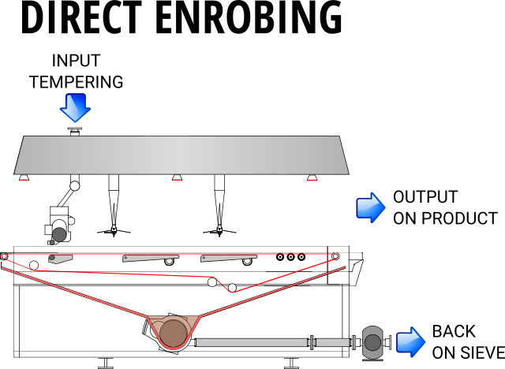
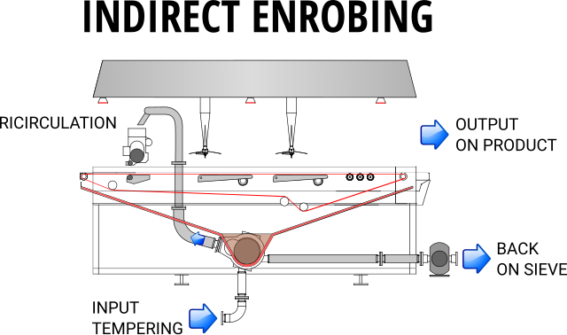
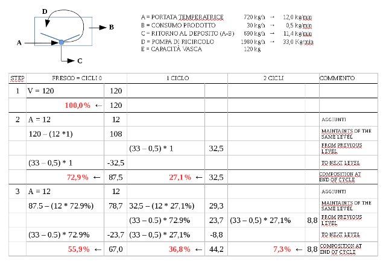

The `enrobing()` is useful to simulate the crystallization of cocoa butter in different condiction:

* Different chocolate flow in input
* Different chocolate consumption for production
* Different enrober setting

The function return invisible data frame containing the composition of the chocolate in the enrobing tube indicando la percentuale di esso che ha compiuto più cicli di pompaggio

## Function

Below the sintax of the function `enrobing()`:

    enrobing(input=1000, output=300, ricircolo=2000, vasca=120, minuti=600, xlim=NULL, ylim=NULL, debug=F, gg=F)
    
where:

    input     :   vector of flow of fresh chocolate from tempering in kg/h                 1000 kg/h
    output    :   vector of chocolate consumption in kg/h                                   300/kg/h
    ricircolo :   vector of flow of reclicling pump in kg/h                                2000 kg/h
    vasca     :   vector of capacity of enrobing tub in kg                                  120 kg
    minuti    :   minute of simulation                                                      600 min
    xlim      :   x axes extension - defaul = Null (automatic)
    ylim      :   y axes extension - defaul = Null (automatic)
    debug     :   if T debug is on - default = F
    gg        :   if T use ggplot2 if F use standard graphics - default = F

## Differences from direct and indirect enrobing

In the **direct enrobing** the chocolate goes directly from the tempering unit to the enrobing top flow and then back to the tank, the heated extension trough could be warm  
In this case the flow rate of the tempering unit will be enough to cover the width of the enrobing unit (normally fro 1 to 3 kg/mm)  

```{r, fig.cap='Direct enrobing', echo=FALSE, out.width="100%", fig.align='center'}

```

In the **indirect enrobing** the chocolate goes from the tempering unit to the reservoir tank of the enrober (sump) and then to the enrobing top flow through the enrobing pump  
In this case the flow rate of the tempering unit will be proportional of the chocolate consuming on the product and lower then the quantity needed to cover the width of the enrobing unit  

```{r, fig.cap='Indirect enrobing', echo=FALSE, out.width="100%", fig.align='center'}

```

## Formula used

In the following tab the step of simulation:

```{r, fig.cap='Flusso simulazione', echo=FALSE, out.width="100%", fig.align='center'}

```

## Examples

In the following graphic we could compare the composition of the chocolate with four different condition:

* with a chocolate infeed of 500 kg/h or 1000 kg/h
* with a chocolate consumption of 200 kg/h or 500 kg/h
* with standard other setting (ricirculation pump of 2000 kg/h and vasca of 120 kg) 

```{r, echo=TRUE, fig.height=7.1, fig.show='hold', fig.width=7.1, warning=FALSE, results='hold'}
library(tecTools)
enrobing(input=c(500, 1000), output=c(200, 500))

```


