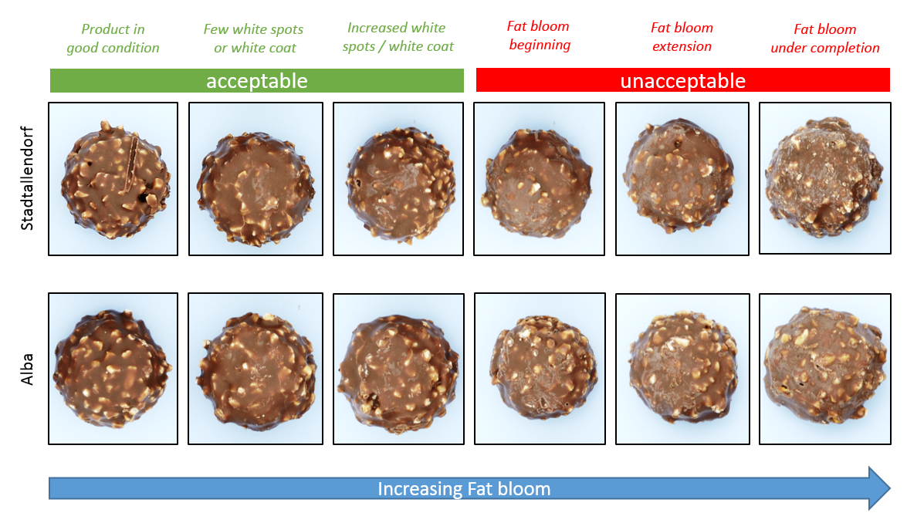

In this section we collect some function to help the fat bloom analysis

## Function

**mosaicFB**: draw a mosaic plot of fat bloom vs month vs 'cluster' field

    mosaicFB(dati, cluster='plant', filter=NULL, depivot=T, main='Affioramento prodotto', sub='')

**stackFB**:

    stackFB(data, main='Titolo', new=c('mese', 'prodotto'), tabOnGraph=T)

**depivot**:

    depivot(dati)
    
where:

    dati       : analysis data frame (see below)
    cluster    : the field use to clusterize the data                                         'plant'
    filter     : filter to apply at data frame                                                   NULL
                 es.1 filter="plant=='Alba'"
                 es.2 filter="plant=='Alba' & line %in% c('L1','L4')"
    depivot    : T = data need to be 'depivot'                                                     T
    main       : graph title                                                     'Products fat-bloom'
    sub        : subtitle (printed below x axis)                                                   ''
    new        : 'mese' plot montly data, 'prodotto' plot data for each product                'mese'
    tabOnGraph : T = plot results on graph                                                          T

## Analysis data frame

The analysis data file for the function `stackFB()`, must contain the following field:

    prodotto    :   identification of the product
    mese        :   month of analysis
    L1-L6       :   number of sample for each levels of fat bloom

as the following example **'RO_OHG'**:

```{r, echo=FALSE}
library(tecTools)
data('RO_OHG')
knitr::kable(head(RO_OHG))
```

---

The analysis data file for the function `mosaicFB` (with option depivot=T), must contain the following field:

    plant        :   test label (used in the legend)
    mese         :   month of analysis
    line         :   line of production
    L1-L6        :   number of sample for each levels of fat bloom

as the following example **'RO_ALL'**:

```{r, echo=FALSE}
library(tecTools)
data('RO_ALL')
knitr::kable(head(RO_ALL[, c(1,6,8,9:14)]))
```

---

The analysis data file the function `mosaicFB` (already depivoted), must contain the following field:

    plant        :   test label (used in the legend)
    mese         :   month of analysis
    line         :   line of production
    affioramento :   level of fat bloom (from 1 to 6) of the praline

as the following example **'RO_ALL_DE'**:

```{r, echo=FALSE}
library(tecTools)
data('RO_ALL_DE')
knitr::kable(head(RO_ALL_DE[, c(1,6,8,9)]))
```

These data are calculated as:

    RO_ALL_DE <- depivot(RO_ALL)

## Examples

### mosaicFB()

**Compare fat-bloom of different plant (defaults options)**

```{r, echo=TRUE, fig.height=7.1, fig.width=7.1, fig.show='hold', warning=FALSE, results='hold'}
library(tecTools)
data('RO_ALL')
mosaicFB(RO_ALL)    # the some graph could be print with mosaicFB(RO_ALL_DE, depivot=F)
```

**Is possible to change cluster field and use filter to subsetting data**

```{r, echo=TRUE, fig.height=7.1, fig.width=7.1, fig.show='hold', warning=FALSE, results='hold'}
library(tecTools)
data('RO_ALL_DE')
mosaicFB(RO_ALL, cluster='line', filter="plant=='Alba' & line %in% c('L1','L4')")
```

**Is possible to clusterize the data using all fields available**

```{r, echo=TRUE, fig.height=7.1, fig.width=7.1, fig.show='hold', warning=FALSE, results='hold'}
library(tecTools)
data('RO_OHG')
mosaicFB(RO_OHG, cluster='product')
```

**Is possible to clusterize using interaction of more fields**

```{r, echo=TRUE, fig.height=7.1, fig.width=7.1, fig.show='hold', warning=FALSE, results='hold'}
library(tecTools)
data('RO_ALL')
mosaicFB(RO_ALL, cluster='plant+line')
```


### stackFB()

In the following graph we could compare the melting point of three differnt chocolate:

```{r, echo=TRUE, fig.height=7.1, fig.width=7.1, fig.show='hold', warning=FALSE, results='hold'}
library(tecTools)
data('RO_OHG')
#stackFB(RO_OHG)
```

```{r, echo=TRUE, fig.height=7.1, fig.width=7.1, fig.show='hold', warning=FALSE, results='hold'}
library(tecTools)
data('RO_OHG')
#stackFB(RO_OHG, tabOnGraph=F)
```

with graph for products

```{r, echo=TRUE, fig.height=7.1, fig.width=7.1, fig.show='hold', warning=FALSE, results='hold'}
library(tecTools)
data('RO_OHG')
#stackFB(RO_OHG, new='product')
```

## Reference

Immagini della scala dei livelli di affioramento

```{r, fig.cap='Onset calculation', echo=FALSE, out.width="100%", fig.align='center'}

```
