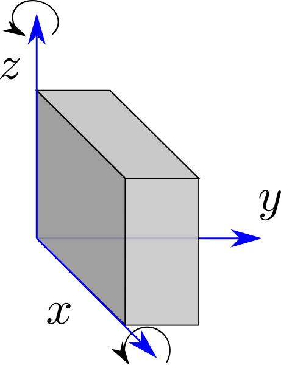

The `simHollow()` function is used to simulate the movement of the mould during production of hollow figures

## Function

Below the sintax of the function `simHollow()`:

    simHollow(g=matrix(c(0,-1,0), ncol=1), rpm1=1, rpm2=6, rpm3=0, sim=120, step=1, seq = F, d3=T){

    
where:

    g       :   define gravity vector
    rpm1    :   asse x - 0= no rotazione >0 rotazione oraria <0 rotazione antioraria              1
    rpm2    :   asse z - 0= no rotazione >0 rotazione oraria <0 rotazione antioraria              6
    rpm3    :   asse y - 0= no rotazione >0 rotazione oraria <0 rotazione antioraria              0
    sim     :   integer, total simulation time in minutes                                       120
    step    :   integer, simulation step in minutes                                               2
    seq     :   boolean, if True plot 'sequential' graph if False plot 'stellar' graph            F
    d3      :   boolean, if True plot 3d graph if False plot 2d graph                             T

## 3D Movements

As you could see below:

* the x axis describe the 'star' movement of the 'ballerina';
* the z axis rapresent the spin movement of the mould  

```{r, fig.cap='Onset calculation', echo=FALSE, out.width="50%", fig.align='center'}

```

## Examples

In the following graph we could compare the melting point of three differnt chocolate:

```{r include=FALSE}
library(tecTools)
```

```{r, echo=TRUE, fig.height=7.1, fig.width=7.1, fig.show='hold', warning=FALSE, results='hold'}
simHollow()
```

```{r, echo=TRUE, fig.height=7.1, fig.width=7.1, fig.show='hold', warning=FALSE, results='hold'}
simHollow(d3=F, seq=T)
```

```{r, echo=TRUE, fig.height=7.1, fig.width=7.1, fig.show='hold', warning=FALSE, results='hold'}
simHollow(d3=F, seq=F)
```

## Reference

The function  `simHollow()` is based on the following article/video ^[available in internet]:

> https://en.wikipedia.org/wiki/Rotation_matrix

> https://www.youtube.com/watch?v=kjBOesZCoqc&list=PLZHQObOWTQDPD3MizzM2xVFitgF8hE_ab
